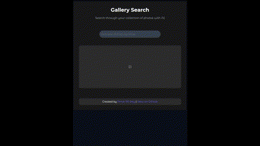
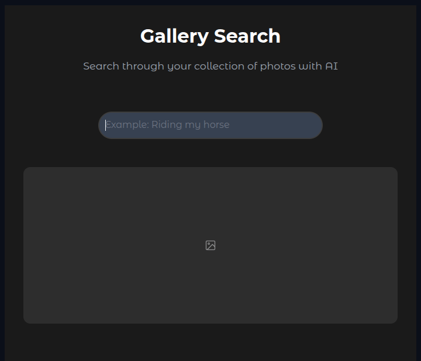

# nanoCLIP

NanoCLIP is a lightweight CLIP-like (Contrastive Language-Image ~~Pre-training~~ Fine-tuning) model for efficient text-to-image retrieval for personal photo galleries. Search your photo collection using natural language, powered by modern AI techniques.



This repository serves as a practical guide to learn:

- **Text-to-Image Retrieval**: Implement and train an efficient CLIP-based model using the Flickr30k dataset
- **Modern ML Practices**: This is an opportunity to learn PyTorch Lightning and how to effectivly structure your training/validation/tracking pipeline.
- **Deployment**: Learn to build efficient FAISS indexes for fast image retrieval and create responsive web applications using Gradio

## Features

- **Natural Language Search**: Search your photos using descriptive text
  - Image Encoder: DINOv2-S with ~22M params
  - Text Encoder: SBERT [all-MiniLM-L6-v2] with ~22M params ([LINK](https://www.sbert.net/docs/sentence_transformer/pretrained_models.html))
- **Fast Indexing**: Efficient image indexing using FAISS (64-dim vector per image or text query)
- **Web Interface**: Clean and responsive UI built with Gradio
- **Lightweight**: Minimal dependencies and optimized for personal use
- **Privacy**: All processing happens locally on your machine

## Project Structure

```
nanoCLIP
├── datasets          		# The training dataset resides here
├── gallery           		# Your gallery of photos and albums that will be deployed
├── logs              		# To track the experiments and save weights and Tensorboard logs
├── deployment
│   ├── create_index.py    	# To load a trained model and create an index for an Album.
│   ├── load_album.py       	# Create a dataset containing all images in an album (inc. subfolder)
│   └── gradio_app.py   	# Gradio APP. contains also inference code (query -> images)
├── src
│   ├── dataset.py    		# PyTorch dataset to read the train/val images and their captions
│   ├── loss.py       		# Implements a contrastive loss to supervise the training
│   ├── models.py     		# Contains the implementation of the Image Encoder and Text Encoder
│   └── nanoclip.py   		# Lightning module to train, validate, and track the training
└── train.py          		# Script to launch the training via the command line
```

## Installation

I personally use Miniconda for managing virtual environments and use `pip` for installing packages. This has always worked for me =). If you don't have Miniconda (or Conda) installed, follow the [Miniconda installation guide](https://docs.anaconda.com/miniconda/install/), then:

1. Clone the repo to your local machine and navigate to the project directory.

   ```
   git clone https://github.com/amaralibey/nanoCLIP
   cd nanoCLIP
   ```
2. Create and activate the `nanoclip` environment:

   ```
   # Create the environment and automatically install all dependencies (might take 3 minutes)
   conda env create -f environment.yml

   # Activate the created environment
   conda activate nanoclip
   ```

## Quick Start

### Prepare the training dataset

In this project, we use Flickr30k dataset [1], for training and validation. We provide a script to automatically download and unzip it into the `dataset/` folder.

```bash
# make sure you are in the nanoCLIP directory
pwd

# run the provided script
bash datasets/download_flickr30k.sh
```

[1] https://shannon.cs.illinois.edu/DenotationGraph/

### Check if the training pipeline is working correctly

You can launch what we call a `dev` iteration. This runs one training iteration and one validation iteration to ensure all training components are functioning correctly. This is made easy with PyTorch Lightning.

```
python train.py --dev
```

### Start training your model

You can now start training your nanoCLIP model. The command line supports the following arguments (but you can add yours in the `train.py` file):

- `--bs`: 	Controls the batch size
- `--lr`: 	Specifies the learning rate (we use AdamW in this project, so choose your `lr` carefully)
- `--dim`: 	to control the dimensionality of the model output (this is important for retrieval, the smallest the dimensionality the faster the search is)

```
python train.py --bs 128 --lr 0.0001 --dim 64
```

Monitor Training with Tensorboard

You can monitor your experiments using TensorBoard (thanks to PyTorch Lightning). When you start training, a folder will be created in the `logs/` directory. Each run of `train.py` generates a new folder with an incremental name, such as `version_xx`.

```bash
# make sure you activated en nanoclip envrironment
conda activate nanoclip

# then run tensorboard
tensorboard --logdir logs/
```

## Deploy Your Model and Create a Gradio App

Now that your nanoCLIP model is trained, it’s ready for deployment. This means it can project text queries (sentences) closer to the images that best match those queries.

To begin:

1. Copy the photos (that will serve as the searchable gallery) into the `gallery/` folder.
2. Edit the `deployment/create_index.py` script to read from the appropriate folder and create a search index. This index will allow text-based image retrieval.

Below is an example of how to modify the `main()` method (in `deployment/create_index.py`) to account for your gallery photos:

```python
def main():
    deployer = NanoCLIPDeployer(
        model_checkpoint='logs/nano_clip/version_xx/checkpoints/xxxxxxx.ckpt',  # IMPORTANT: Use the checkpoint of the best model you trained
        txt_model="sentence-transformers/all-MiniLM-L6-v2",  # Text embedding model architecture
        img_model="dinov2_vits14",                           # Image embedding model
        embed_size=64,                                       # Dimensionality of embeddings
        device="cuda",                                       # Use 'cuda' for GPU or 'cpu' if a GPU is unavailable
        gallery_path="./gallery/my_photos",                  # <==== Path to your photo gallery
    )
```

3. Run the Script: Use the following command to create the index.

```python
python deployment/create_index.py
```

Once the script runs, three new files will be generated:

1. **`img_encoder_state_dict.pth`**: stored in the `deployment/` folder, this file represents the trained weights of the image encoder. It could be used to update the gallery when new images are added or removed
2. **`txt_encoder_state_dict.pth`**: stored in the `deployment/` folder, this file contains the trained weights of the text encoder. It will be used by the Gradio app to generate embeddings for text queries.
3. **FAISS Index (`my_photos.faiss`):** created in the `gallery/` folder (named based on the gallery folder), this file serves as the searchable index.

### Run you Gradio app

Your app is now ready to be launched locally or deployed. To ensure everything works correctly, edit the `deployment/gradio_app.py` file to specify the correct album and text encoder.

```python

if __name__ == "__main__":
    search_engine = ImageSearchEngine(
        model_name = "sentence-transformers/all-MiniLM-L6-v2",  # Ensure this matches the architecture of the text encoder (txt_encoder_state_dict.pth)
        output_dim = 64,
        gallery_folder = "my_photos", 				# Specify the name of your album or gallery folder (also the same name as the index, e.g. my_photos.faiss)
    )
    ui = GalleryUI(search_engine)
    demo = ui.create_interface()
  
    # Launch the interface on port 7860
    # 0.0.0.0 makes the interface available on all network interfaces (through wifi or LAN for example)
    demo.launch(server_name="0.0.0.0", server_port=7860)
```

 Now you can locally deploy the app by running the python script:

```
   gradio deployment/gradio_app.py
```

This will launch the app on `http://localhost:7860`

You can access it in your browser. It should look like this:

   

**Note:** you can also deploy your app for free on Hugging Face (*DO NOT DO THIS  IF PRIVACY OF YOUR ALBUMS IS  A CONCERN). You can follow the [Hugging Face Spaces documentation](https://huggingface.co/docs/hub/en/spaces-overview) to upload and run your app.
